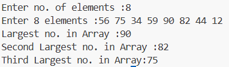
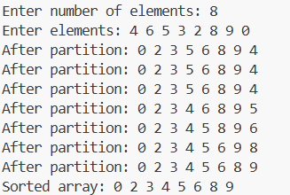
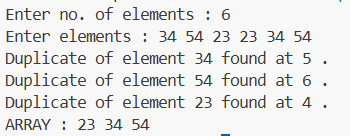

# C Programs Repository  

This repository contains a collection of **C programming exercises** organized into categories such as **Basics** and **Arrays**.  
Each program includes its **source code (.c)**, **compiled executable (.exe)**, and the **output screenshot (.png)** for easy reference.  

---

## 📝 Program List  

### 🔹 BASICS  
| Program | Source Code | Executable | Output |
|---------|-------------|------------|--------|
| Count occurrence of digits in a number | [OccurenceCount.c](./BASICS/OccurenceCount.c) | [OccurenceCount.exe](./BASICS/OccurenceCount.exe) |  |
| Reverse an array | [ReverseArray.c](./BASICS/ReverseArray.c) | [ReverseArray.exe](./BASICS/ReverseArray.exe) |  |
| Reverse a number | [ReverseNum.c](./BASICS/ReverseNum.c) | [ReverseNum.exe](./BASICS/ReverseNum.exe) |  |
| Reverse a string | [ReverseString.c](./BASICS/ReverseString.c) | [ReverseString.exe](./BASICS/ReverseString.exe) |  |

---

### 🔹 ARRAYS  
| Program | Source Code | Executable | Output |
|---------|-------------|------------|--------|
| Find largest number in array | [LargestNums.c](./ARRAYS/LargestNums.c) | [LargestNums.exe](./ARRAYS/LargestNums.exe) |  |
| Quick Sort implementation | [QuickSort.c](./ARRAYS/QuickSort.c) | [QuickSort.exe](./ARRAYS/QuickSort.exe) |  |
| Remove duplicates from array | [RemoveDuplicates.c](./ARRAYS/RemoveDuplicates.c) | [RemoveDuplicates.exe](./ARRAYS/RemoveDuplicates.exe) |  |
| Search element in array | [SearchElement.c](./ARRAYS/SearchElement.c) | [SearchElement.exe](./ARRAYS/SearchElement.exe) |  |

---

## ⚙️ How to Run  

1. Clone the repository  
   ```bash
   git clone https://github.com/YourUsername/YourRepoName.git
   cd YourRepoName
