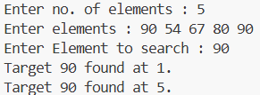
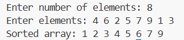

# 📚 DSA Programs

This repository contains my solutions to various Data Structures and Algorithms problems, implemented in C.  
The programs are organized by topic, and each file demonstrates a specific concept with clear and concise code.  
These implementations are meant for learning, practice, and quick reference.

---

## 📂 PART-01 – Arrays

## 1. [ARRAYS-01.C](PART-01/ARRAYS1.C)
**Output:**

---

## 2. [ARRAYS-02.C](PART-01/ARRAYS2.C)
**Output:**

---

## 3. [ARRAYS-03.C](PART-01/ARRAYS3.C)
**Output:**

---

## 4. [ARRAYS-04.C](PART-01/ARRAYS4.C)
**Output:**

---
